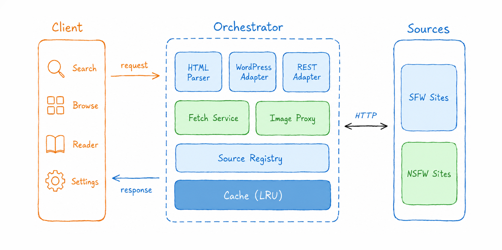

<h1 align="center">
   
  <a href="https://github.com/jevenchy/librarytoon">
    <picture>
      
    </picture>
  </a>
   
  Librarytoon
   
</h1>

Self-hosted manhwa/manga aggregator

  
  
  

## Overview

Read manhwa/manga from multiple sites in one place. No ads, no broken links, no pop-ups.

> [!IMPORTANT]
> Create this for anyone who might need it. A star means it helped.

## How it Works

  

> [!WARNING]
> 18+ Content Warning

- **Adapter Engine** : picks the right adapter per source (HTML / WordPress / REST API)
- **Fetch Service**  : handles retry, rate limiting, and headers per source
- **Image Proxy**    : serves images from blocked origins via `/api/img`
- **Source Registry**: per-source configuration via JSON, no code changes needed
- **Cache**          : LRU cache for search results and chapter lists

## Contributing

Got something to add?

- Add a source or fix a bug: [pull request](https://github.com/jevenchy/librarytoon/pulls).
- Request a source or report a bug: [open an issue](https://github.com/jevenchy/librarytoon/issues).

